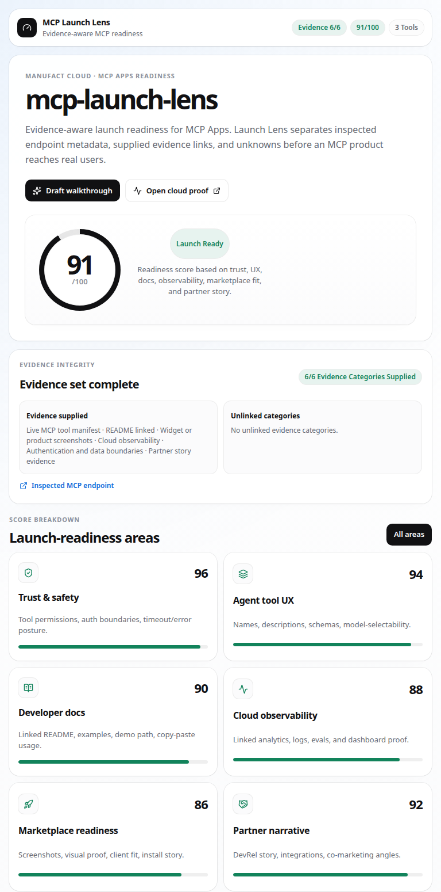
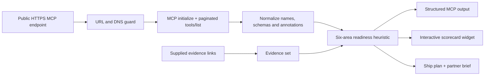

<!-- markdownlint-disable MD013 -->

# MCP Launch Lens

**Inspect a live MCP server. Separate endpoint facts from supplied proof. Turn launch gaps into a scorecard and ship plan.**

MCP Launch Lens is a widget-backed MCP App deployed on Manufact Cloud. It connects to a public Streamable HTTP MCP endpoint, reads the server identity and paginated `tools/list` surface, normalizes the available metadata, and scores six practical launch dimensions: trust, agent tool UX, documentation, observability, marketplace readiness, and partner narrative.

[](./package.json)
[](https://modelcontextprotocol.io/)
[](https://manufact.com/cloud/org-bb5b108a-sifrx/servers/38b23d2a-f688-47b7-8425-59e143dcd6e1)
[](./LICENSE)



## Try the live app

- **MCP endpoint:** <https://keen-steel-bs1nz.run.mcp-use.com/mcp>
- **Manufact Inspector:** <https://inspector.manufact.com/inspector?autoConnect=https%3A%2F%2Fkeen-steel-bs1nz.run.mcp-use.com%2Fmcp>
- **Manufact Cloud dashboard:** <https://manufact.com/cloud/org-bb5b108a-sifrx/servers/38b23d2a-f688-47b7-8425-59e143dcd6e1>
- **Application proof and Loom script:** [`APPLICATION_PROOF.md`](./APPLICATION_PROOF.md)

## The problem

A server can complete an MCP handshake and still be hard to launch.

A real launch also needs:

- tool names and schemas that models can select correctly;
- honest side-effect and open-world annotations;
- a clear authentication and data-boundary story;
- examples that a developer can reproduce;
- deployment and observability proof;
- a visual client experience when the workflow benefits from one; and
- a partner narrative tied to a concrete user outcome.

MCP Launch Lens makes those launch requirements visible in one artifact. It is deliberately broader than a security scanner and narrower than a penetration test.

## How it works



1. **Inspect** — initialize a Streamable HTTP MCP session and read up to ten pages of `tools/list`.
2. **Normalize** — map tool descriptions, JSON Schemas, and MCP annotations into a conservative internal model.
3. **Separate** — keep inspected endpoint metadata distinct from user-supplied README, screenshot, dashboard, auth, and partner links.
4. **Score** — apply a deterministic heuristic across six launch-readiness areas.
5. **Act** — return structured findings, priority actions, launch-path guidance, and an interactive MCP Apps widget.

No inspected tool is executed.

## MCP tools

| Tool | What it does | Output |
| --- | --- | --- |
| `assess-mcp-launch` | Inspects a public HTTPS MCP endpoint or accepts an explicit manual manifest; missing evidence fails closed | Structured report + interactive widget |
| `generate-partner-brief` | Turns a partner, integration goal, and target client into a short DevRel launch motion | Structured brief + proof checklist |
| `compare-launch-paths` | Compares Manufact Cloud, ChatGPT Apps, Claude Connectors, and generic MCP clients against the stated goal | Recommendation + fit/proof/risk matrix |

All three tools use described Zod inputs, structured output schemas, and MCP annotations. The assessment tool is read-only but marked `openWorldHint: true` because it connects to the supplied public endpoint.

## Evidence model

Launch Lens distinguishes three states:

| State | Meaning |
| --- | --- |
| `complete` | Every evidence category required for this assessment was supplied, including a live tool manifest |
| `partial` | Some endpoint metadata or evidence exists, but at least one category is missing |
| `insufficient` | No meaningful tool surface or evidence was supplied |

The six evidence categories are:

1. live MCP tool manifest;
2. README or developer documentation;
3. widget or product screenshots;
4. cloud observability;
5. authentication and data-boundary documentation; and
6. partner brief, launch plan, or outcome evidence.

**Important:** “complete” means the evidence set is complete, not that Launch Lens independently validated every linked artifact. The live MCP metadata is inspected directly; external proof links are recorded as supplied evidence. Unknowns remain unknown.

## Readiness heuristic

| Area | Signals used |
| --- | --- |
| Trust & safety | Read/write/destructive posture, open-world hints, explicit auth gaps, timeout declarations |
| Agent tool UX | Capability-specific names, useful descriptions, meaningful object schemas |
| Developer docs | Linked README and explicit example evidence when available |
| Cloud observability | Linked deployment, logs, analytics, dashboard, or eval artifact |
| Marketplace readiness | Visual proof, target-client fit, install/demo story, auth boundaries for write tools |
| Partner narrative | Multiple client paths plus linked partner or outcome evidence |

The score is a deterministic launch heuristic, not a certification, vulnerability scan, or guarantee of client compatibility. Its job is to expose missing proof and force weak claims to stay visible.

## Run a live self-assessment

```bash
npx -y mcp-use@latest client connect launch-lens \
  https://keen-steel-bs1nz.run.mcp-use.com/mcp

npx -y mcp-use@latest client launch-lens tools call assess-mcp-launch '{
  "mcpUrl": "https://keen-steel-bs1nz.run.mcp-use.com/mcp",
  "description": "Evidence-aware launch readiness for MCP Apps.",
  "targetClients": ["ChatGPT Apps", "Claude Connectors"],
  "readmeUrl": "https://github.com/Niraven/mcp-launch-lens#readme",
  "screenshotUrls": [
    "https://raw.githubusercontent.com/Niraven/mcp-launch-lens/main/launch-lens-v1.1-evidence.png"
  ],
  "observabilityUrl": "https://manufact.com/cloud/org-bb5b108a-sifrx/servers/38b23d2a-f688-47b7-8425-59e143dcd6e1",
  "authDocsUrl": "https://github.com/Niraven/mcp-launch-lens#endpoint-safety-and-data-boundaries",
  "partnerEvidenceUrl": "https://github.com/Niraven/mcp-launch-lens/blob/main/APPLICATION_PROOF.md#positioning"
}' --screenshot --screenshot-output ./launch-lens.png
```

The call returns a typed report and renders the scorecard. A complete evidence set can still remain `nearly-ready`: missing auth, timeout, or network-scope declarations block `launch-ready` even when every proof category has a link. Re-run the command rather than treating any score as permanent—the endpoint and evidence can change.

### Companion calls

```bash
npx -y mcp-use@latest client launch-lens tools call generate-partner-brief \
  company='Manufact' \
  integrationGoal='Turn an MCP launch into visible deployment and observability proof' \
  targetClient='ChatGPT Apps'

npx -y mcp-use@latest client launch-lens tools call compare-launch-paths \
  product='MCP Launch Lens' \
  primaryGoal='visual product demo'
```

## Endpoint safety and data boundaries

Remote MCP inspection is a server-side request boundary, so the implementation is intentionally restrictive:

- public **HTTPS** endpoints only;
- Streamable HTTP transport only;
- credentials in URLs and all query parameters are rejected;
- `localhost`, `.local`, private, loopback, link-local, reserved, documentation, and mixed public/private DNS answers are rejected;
- DNS is checked before the initial request and every transport fetch;
- redirects are not followed;
- each connection/request has a bounded timeout;
- tool listing is capped at ten pages;
- inspected tools are never called; and
- the client closes in a `finally` block.

The application code has no database or persistence layer. Manufact Cloud may retain platform-level deployment and request logs according to the host environment. Launch Lens currently does not accept authorization headers, so it is for public MCP endpoints—not private or authenticated servers.

Relevant implementation: [`src/inspectEndpoint.ts`](./src/inspectEndpoint.ts).

## Widget experience

The assessment renders a responsive MCP Apps widget with:

- a launch score and verdict;
- explicit evidence completeness;
- six selectable readiness areas;
- filters for `Fix`, `Watch`, and `Pass` findings;
- a prioritized ship plan;
- a generated partner brief;
- a follow-up action for a 60-second walkthrough; and
- direct links to the inspected endpoint and supplied cloud proof.

The widget uses typed props, structured output, persisted UI state, theme awareness, reduced-motion support, accessible pressed states, and `<McpUseProvider autoSize>`.

## Local development

### Requirements

- Node.js 20+
- npm

```bash
git clone https://github.com/Niraven/mcp-launch-lens.git
cd mcp-launch-lens
npm install
npm test
npm run build
npm run dev
```

Use the port printed by `mcp-use dev`; if `3000` is occupied, the inspector may start elsewhere.

```bash
npx -y mcp-use@latest client connect launch-lens-local \
  http://localhost:<printed-port>/mcp
npx -y mcp-use@latest client launch-lens-local tools list
```

### Verification suite

`npm test` covers:

- empty input failing closed;
- complete and partial evidence states;
- destructive and unauthenticated tool penalties;
- partner-evidence requirements;
- MCP annotation/schema mapping;
- private/reserved IP rejection;
- credential-bearing query rejection; and
- launch-path and partner-brief behavior.

`npm run build` compiles the server and widget, generates registry types, and runs the TypeScript type check.

## Project structure

```text
index.ts                                      MCP server and tool contracts
src/inspectEndpoint.ts                        guarded live MCP inspection
src/launchLens.ts                             deterministic scoring and briefs
resources/product-search-result/widget.tsx    interactive MCP Apps widget
resources/product-search-result/types.ts      widget/report schemas
resources/styles.css                           theme and responsive UI
scripts/test-launch-lens.ts                    deterministic regression checks
APPLICATION_PROOF.md                           deployment proof + Loom script
```

## Deploy to Manufact Cloud

Verify authentication first:

```bash
npx -y mcp-use@latest whoami
```

Then deploy from the pushed GitHub revision:

```bash
npx -y mcp-use@latest deploy -y --org org-bb5b108a-sifrx
```

For a platform-managed source upload instead:

```bash
npx -y mcp-use@latest deploy --no-github -y --org org-bb5b108a-sifrx
```

## Loom walkthrough

A clean 75–90 second recording flow:

1. **Problem (10s):** “A valid MCP handshake does not mean an integration is ready to launch.”
2. **Live proof (15s):** show the Manufact endpoint and Cloud dashboard.
3. **Inspection (15s):** call `assess-mcp-launch` against the public endpoint and point out that it reads the real `tools/list` surface.
4. **Widget (25s):** show evidence completeness, the six scores, finding filters, and the ship plan.
5. **DevRel motion (15s):** generate a partner brief and compare launch paths.
6. **Close (10s):** “This is how I think about DevRel and partnerships: make the product legible, make the proof reproducible, and turn technical gaps into a launch motion.”

The exact talk track is in [`APPLICATION_PROOF.md`](./APPLICATION_PROOF.md).

## Positioning and related work

Launch Lens connects three layers of MCP work:

- **protocol and guardrails:** [`@niraven/mcp-gateway`](https://github.com/Niraven/mcp-gateway);
- **agent memory and workflow learning:** [`myelin`](https://github.com/Niraven/myelin); and
- **launch, adoption, and partner proof:** this repository.

That progression is intentional: reliable infrastructure matters, but DevRel turns infrastructure into something developers can understand, trust, adopt, and advocate for.

## License

[MIT](./LICENSE)
